# Apple Pay integrating

- [Apple Pay integrating](#apple-pay-integrating)
  - [Create Merchant ID and signed certificate](#create-merchant-id-and-signed-certificate)
  - [Extract private key from KeyChain](#extract-private-key-from-keychain)
  - [Upload certificate to Portal](#upload-certificate-to-portal)
  - [Set up Merchant ID in Mobile SDK configuration](#set-up-merchant-id-in-mobile-sdk-configuration)

To use Apple Pay as a payment method, you must create a Merchant ID and the corresponding certificate. And upload the certificate to the portal. In this section we will show you how to create a Merchent ID and how to get the certificate. If you do not want to use Apple pay you can ignore this section.

### Create Merchant ID and signed certificate

1. open xCode and click on your project and go to tab `Signing & Capabilities` 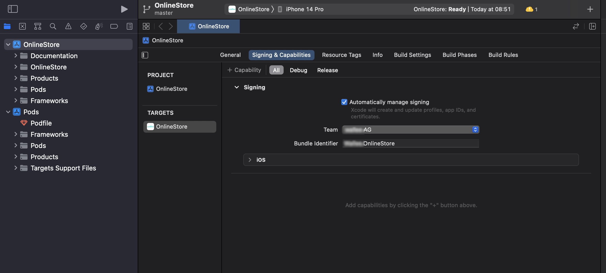
2. on this tab click to `+ Capability` and write `Apple Pay` into search bar 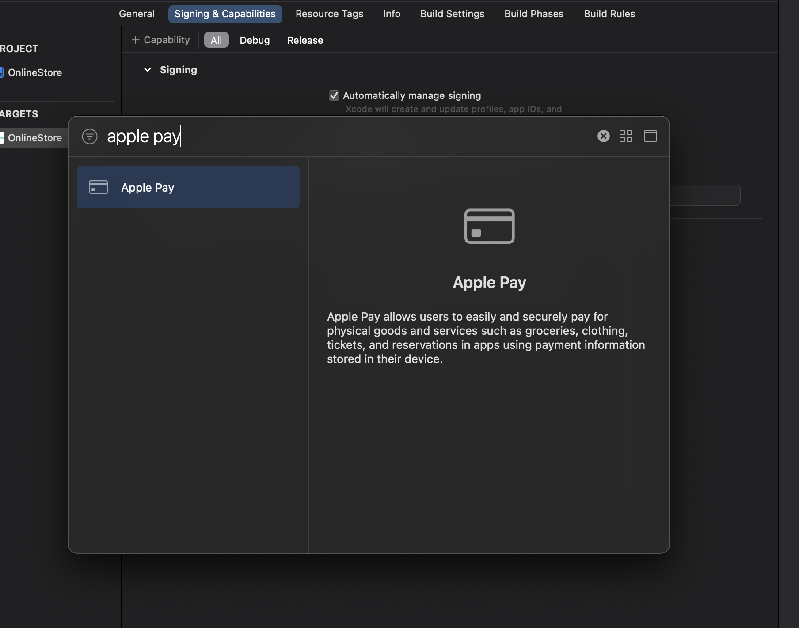
3. after confirming the dialogue a new section will be added 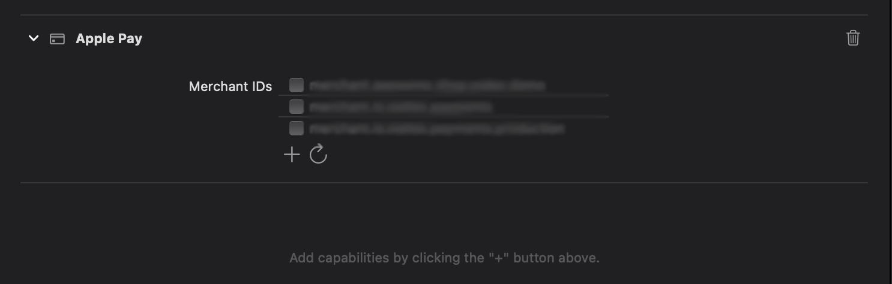
4. Click on plus icon and create you new Merchant ID. 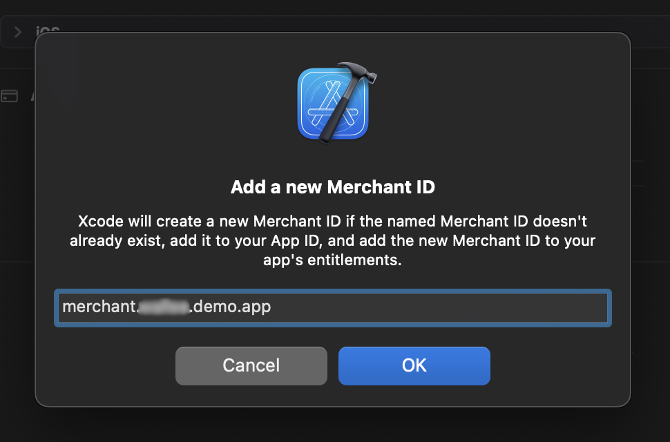
5. Once your Merchant ID is created, it will be sent to the certificate on [developer.apple.com](https://developer.apple.com/account/resources/certificates/list). Open your `identifiers` you can use filter `Merchant IDs` in right top corner. 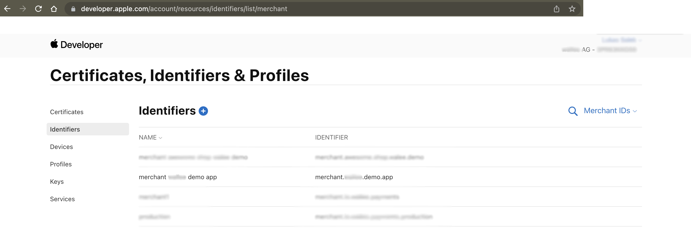
6. Click on the Merchant ID you created. At this page you need to create `Apple Pay Payment Processing Certificate` in this section click on `Create Certificate` 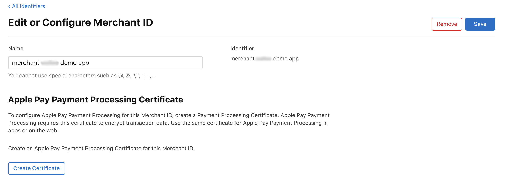
7. You will be ask for additional information. When you answer you can click on `Continue` button 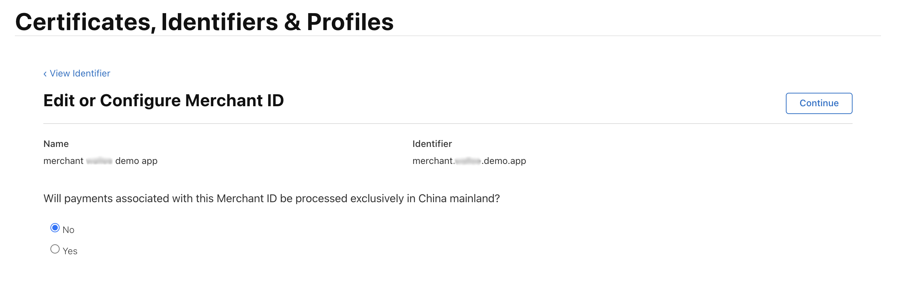
8. Now you have to create and upload `Certificate Signing Request`. Open `Keychain Access` on you Mac and go to top bar menu `Keychain Access => Certificate Assistant => Request a Certificate From a Certificate Authority...` 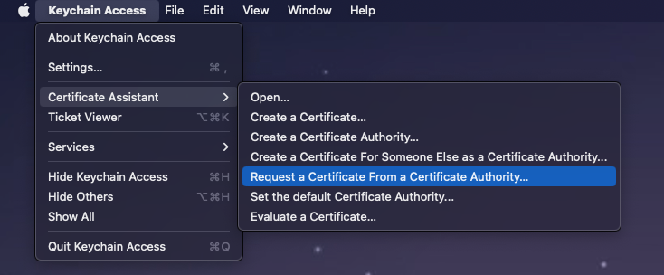
9. Now you have to fill basic information about certificate request and select `Saved to disk` and also check `Let me specify key pair information` and click on `Continue` 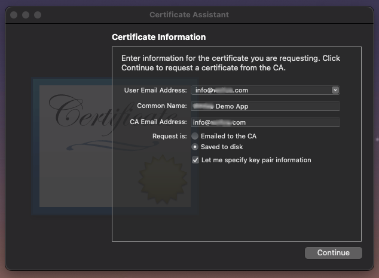
10. In next window you have to specify type of certificate request you have to select `Algorithm: ECC` and `Key Size: 256 bits` then you can click on `Continue` and save your certificate request to disk 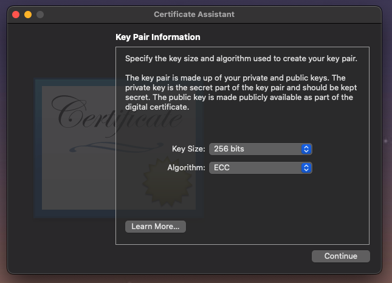
11. Now you have to upload saved certificate request to apple developer page and click on `Continue` 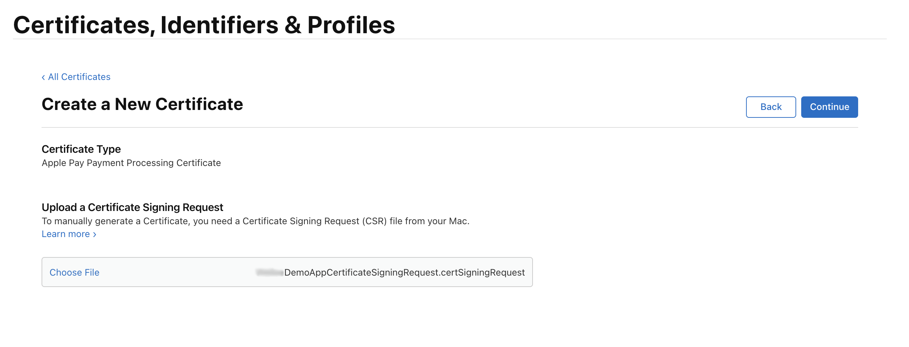 12.Your certificate was successfully created. You can download it. Next step will be uploading this certification to [Portal](#upload-certificate-to-portal). 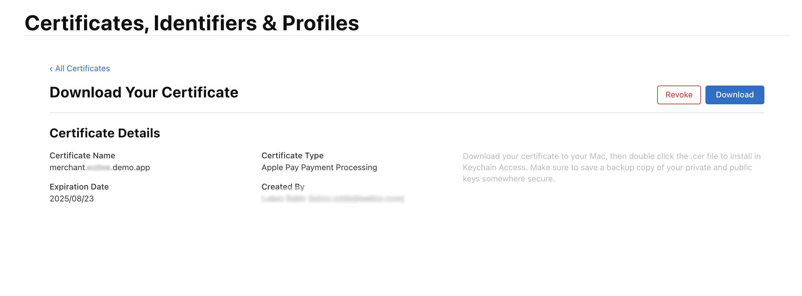

### Extract private key from KeyChain

1. Open KeyChain => Login => Keys 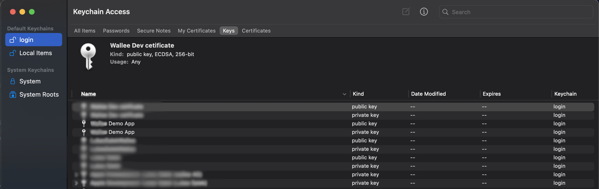
2. Right click at your private key and select option `Export YOUR CERTIFICATE NAME` 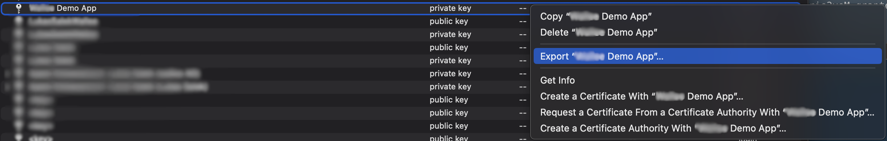
3. You have to save this private key as `Personal Information Exchange (.p12)` format. 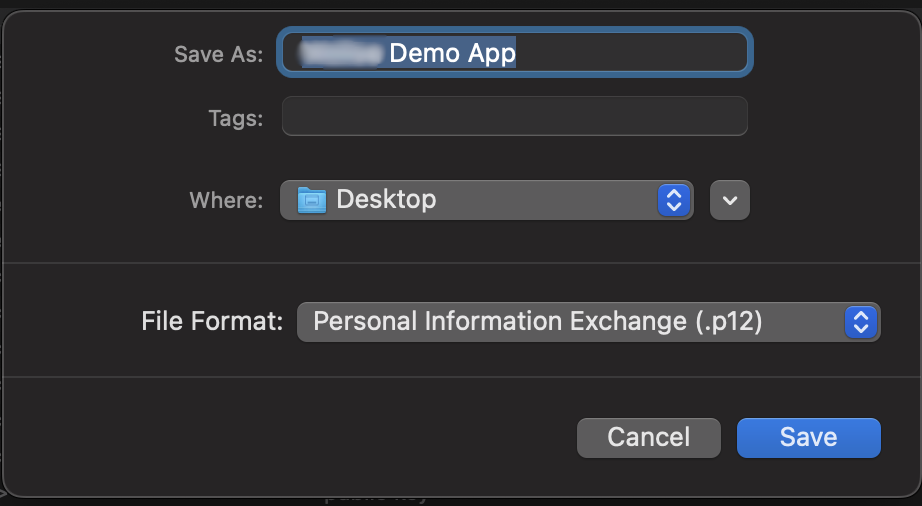
4. After saving this certificate you will be asked to create a password. Keep the password field empty! And continue by pressing `OK` 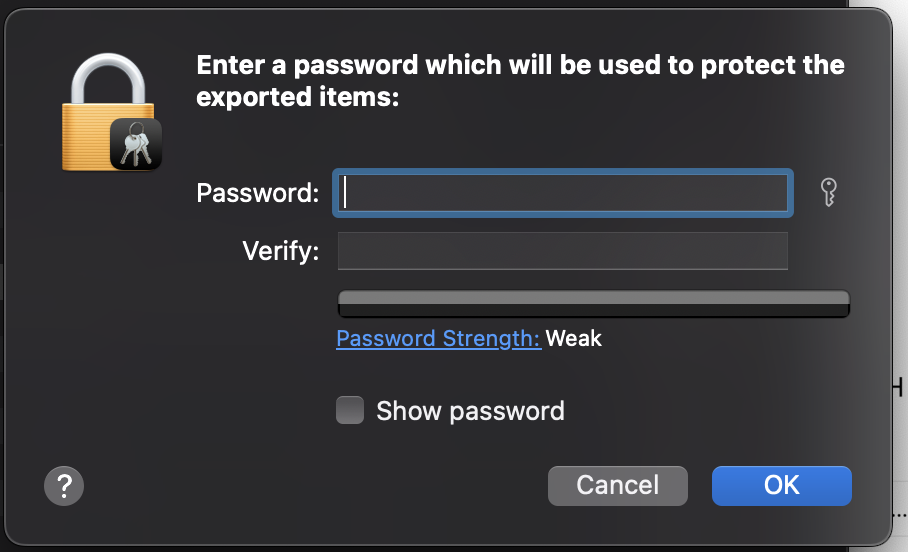
5. Next step is just confirm action with your personal password and after conformation you will get `.p12` certificate. This certificate has to be uploaded to [Portal](#upload-certificate-to-portal)

### Upload certificate to Portal

1. Open Portal => Space => Select Relevant Space => Settings
2. On the top menu select Payment => ApplePay 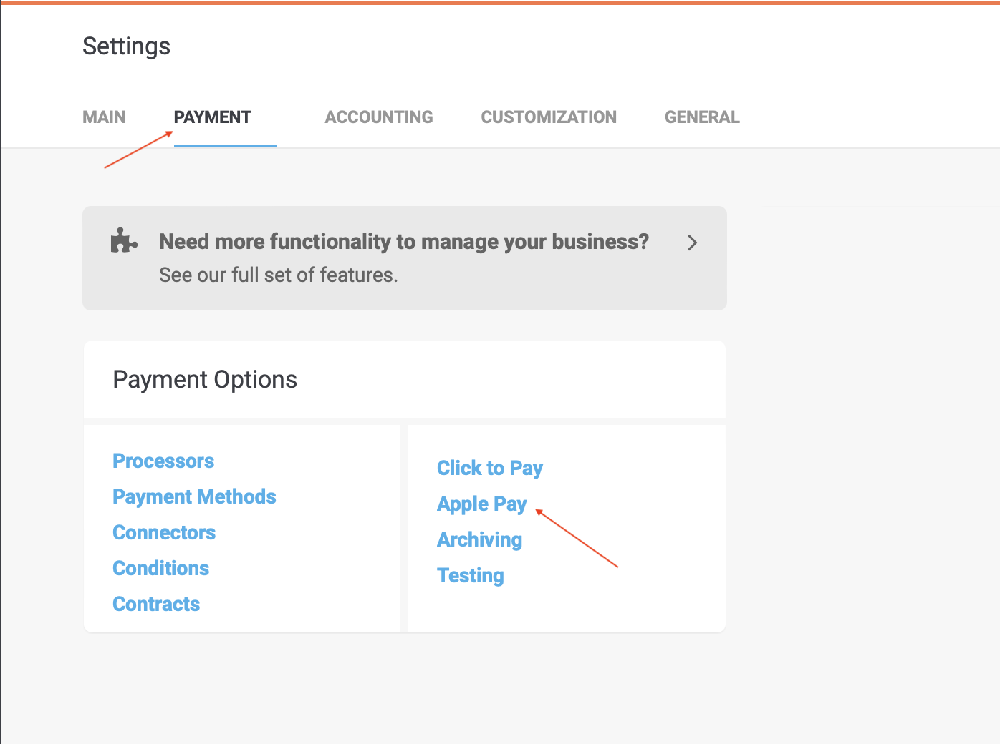
3. Make sure ApplePay is enabled
4. Click Payment Processing Certificate 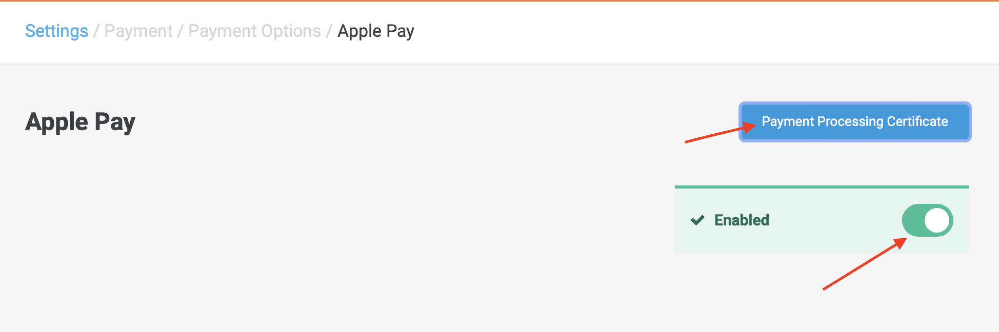
5. Fill in the Merchant Identifier and attach Private Key File and Payment Processing Certificate File in the following window: 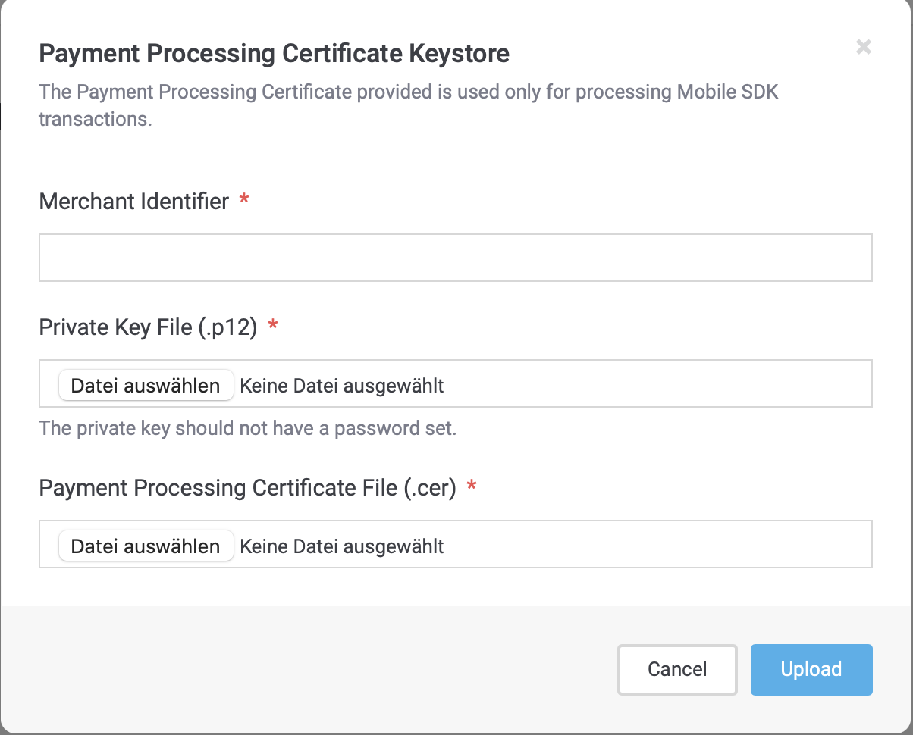

### Set up Merchant ID in Mobile SDK configuration

The final step is setting up the Merchant ID in SDK configuration. To do so, please call the `configureApplePay(merchantId: "merchant.your.id")` method with the relevant Merchant ID. This method can be called for example after SDK initialization.

```
        paymentSdk = WalleePaymentSdk(eventObserver: self)
        guard let paymentSdk = paymentSdk else { return }
        paymentSdk.configureApplePay(merchantId: "merchant.your.id")
```
